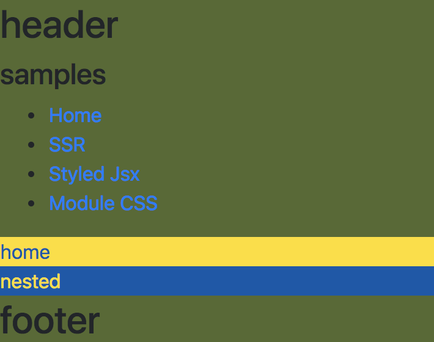

# Next.js TypeScript GraphQL Identity Manager



### Latest update
- nodejs@13.9.0
- typescript@3.8.2, next@9.2.2, react@16.13

## Feature
 - TypeScript
 - Styled-jsx
 - Module css **(PostCSS - cssnext, nested, import)**
 - SEO & analytics(Google Analytics)
 - Storybook **(support module css)**
 - Jest & Enzyme **(support module css)**

## Installation

```sh
git clone https://github.com/deptno/next.js-typescript-starter-kit my-project
cd my-project
rm -r .git
yarn
```

## Run :rocket:

#### :rocket: Test
```bash
yarn test # test
yarn test:watch
yarn test:coverage # report coverage
```

<details><summary>~~:rocket: StoryBook~~</summary>
<p>

#### :rocket: StoryBook
```bash
yarn storybook # open browser localhost:6006
```

```bash
yarn build-storybook # Build storybook static assets
```

</p>
</details>

### :rocket: Development

```bash
yarn start:dev # run
```

### :rocket: Production

#### Serve
```bash
yarn
yarn build # create .next directory
yarn start # start server
```

#### Build static HTML
```bash
yarn
yarn build # create .next directory
yarn export # create .out directory
```

## Configuration

Set SEO variables

> src/constants/env.ts

```typescript
// for meta tag <og & twitter>
export const SITE_NAME = ''
export const SITE_TITLE = ''
export const SITE_DESCRIPTION = ''
export const SITE_IMAGE = ''
```

If each variable evaluated false, it does not load related library

## Usage

### Installation

To support running the project locally you will need to create local environment settings (as we don't keep secrets in the source code - obviously)

So create a file in the root of this project called ".env"

The body of this file should contain the following...

> .env

```.env
SERVER_HOST=www.identitymanager.local
SERVER_PORT_HTTP=3000
SERVER_PORT_HTTPS=44370

SSL_CERT_PFXFILE=
SSL_CERT_PASSPHRASE=

COOKIE_SECRET=

MONGO_URI=

IDENTITY_URL=
IDENTITY_CLIENT_ID=
IDENTITY_CLIENT_SECRET=

GRAPHQI_URI=https://localhost:44344/graphql

GOOGLE_TRACKING_ID=

NODE_TLS_REJECT_UNAUTHORIZED=0
```

To correctly fill in the required information you will need to create a self-signed certificate for the HTTPS server.

Run the following command from an administrative Powershell terminal

```Powershell (Admin)
New-SelfSignedCertificate -DnsName "www.identitymanager.local", "identitymanager.local", "localhost" -KeyFriendlyName "identitymanager.local"
```

Next open Certificates MMC snap-in and connect to your computer certificate store and find the certificate that was just created (it should be in the Personal certificate list)

Export this certificate (including the key) using PFX and encrypt the certificate with a password. The file should be saved in the project root folder.

Set the certificate filename and password in your .env file as SSL_CERT_PFXFILE and SSL_CERT_PASSPHRASE respectively.

### Module CSS ([src/components/Home.tsx](src/components/Home.tsx))

```typescript jsx
import * as classnames from 'classnames'
import * as css from './Home.css'

export const Just = props => <div className={css.className}>
export const Mixed = props => <div className={classnames('row', 'home', css.home)}>
```

### Styled-jsx

#### Global scope ([src/components/Layout.tsx](src/components/Layout.tsx))

```typescript jsx
const Layout = props =>
  <head>
    <style jsx global>{`
      div > * {
        font-size: 32px;
      }
    `}
    </style>
  </head>
```

#### Local scope ([src/components/Home.tsx](src/components/Home.tsx))

```typescript jsx
export const Home = props =>
  <div>
    <style jsx>{`{
      color: darkred;
    }`}</style>
    home
  </div>
```

#### Others

- styled-jsx/css [issue#2](https://github.com/deptno/next.js-typescript-starter-kit/issues/2)
- external css, module [issue#3](https://github.com/deptno/next.js-typescript-starter-kit/issues/3)

### Related

- [typescript-monorepo-next-example](https://github.com/deptno/typescript-monorepo-next-example) - Next.js version
